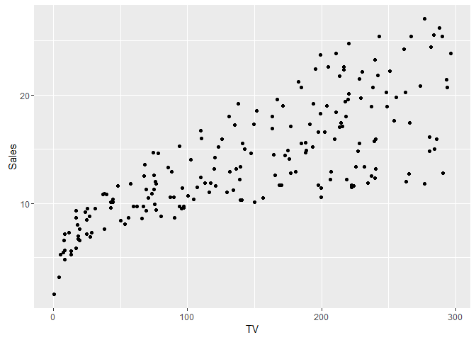
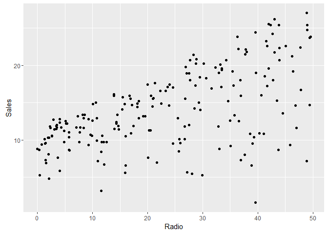
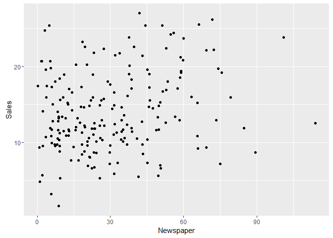
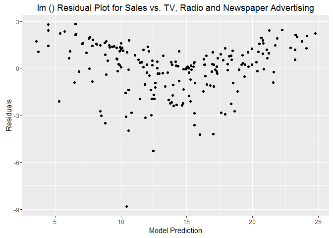
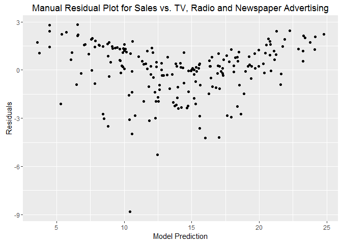
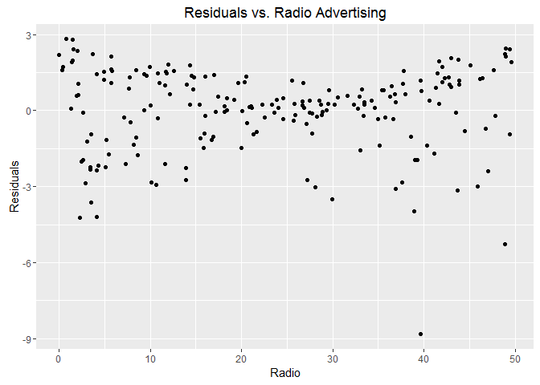
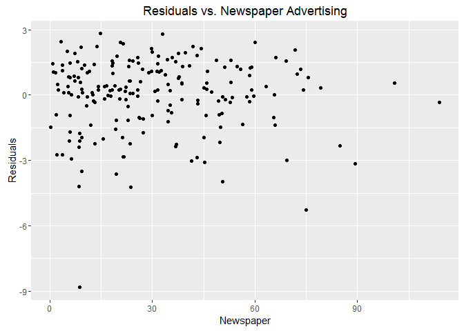
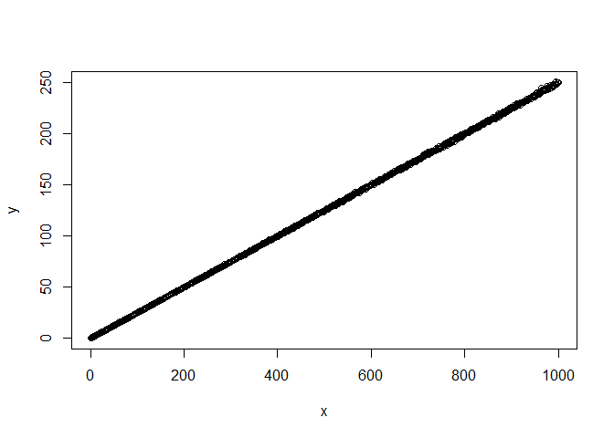
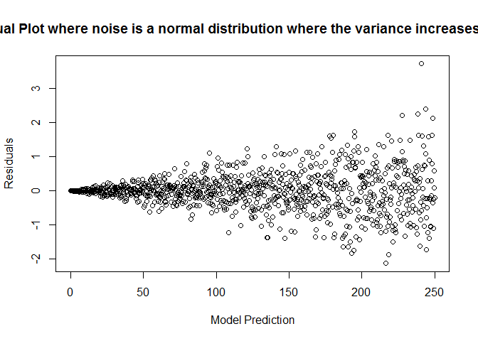

# AQM_Nov9_Advertising
David Dvorak  
November 12, 2016  


## Assignment Due Nov. 16, 2016

Derive and manually compute the following in R, then cross-check them to the R output from `lm()` (use Advertising.csv, as used in class):

* Estimates of the coefficients using matrix notation.
* Residuals using matrix notation.
* Plot residuals against each explanitory variable. Interpret.


Input the data on Sales vs. spending on TV, Newpaper and Radio advertising

```r
dat.adv <- read.csv("advertising.csv")
Sales <- dat.adv$Sales
TV <- dat.adv$TV
Radio <- dat.adv$Radio
Newspaper <- dat.adv$Newspaper
```
Linear least squares regression for each of the possible explanatory variables

```r
mod <- lm(Sales ~ TV+Radio+Newspaper, dat.adv)
```
Residuals for linear least squares fitting

```r
res <- residuals(mod)
```

Plot Sales vs. Explanatory Variables

```r
qplot(TV,Sales) # tilda usage: Sales "depends on" TV. Equivalent to plot(TV,S)
```

<!-- -->

```r
qplot(Radio,Sales)
```

<!-- -->

```r
qplot(Newspaper,Sales)
```

<!-- -->

Plot Residuals vs. Model Predictions

```r
qplot(predict(mod), res,
     main = "lm () Residual Plot for Sales vs. TV, Radio and Newspaper Advertising",
     xlab = "Model Prediction",
     ylab = "Residuals")
```

<!-- -->

```r
# Note: run a single line using alt+enter
```

Matric multiplication check of linear fitting where $\beta = (X^{T}X)^{-1}Y^{T}Y$ and Residual $= (Y-X\beta)$

```r
X <- as.matrix(dat.adv[,2:4]) # design matrix
Y <- as.matrix(dat.adv[,5]) # response variable
#X <- cbind(1,dat.adv$TV,dat.adv$Radio,dat.adv$Newspaper)
X <- cbind(1, X) #rep(1,length(Y))
beta <- solve(t(X) %*% X)  %*% t(X) %*% Y
Y_hat <- X %*% beta
res_manual <- (Y - (X %*% beta))

qplot(Y_hat,res_manual,
    main = "Manual Residual Plot for Sales vs. TV, Radio and Newspaper Advertising",
    xlab = "Model Prediction",
    ylab = "Residuals")
```

<!-- -->


```r
mod
```

```
## 
## Call:
## lm(formula = Sales ~ TV + Radio + Newspaper, data = dat.adv)
## 
## Coefficients:
## (Intercept)           TV        Radio    Newspaper  
##    2.938889     0.045765     0.188530    -0.001037
```

```r
beta
```

```
##                   [,1]
##            2.938889369
## TV         0.045764645
## Radio      0.188530017
## Newspaper -0.001037493
```
As seen above, the outputs of the `lm()` function and the matrix form calculation produce the same coefficients and residuals plots.

Here we plot the residuals against each explanatory variable:

```r
qplot(TV,res_manual,
           main = "Residuals vs. TV Advertising",
           xlab = "TV",
           ylab = "Residuals")
```

<!-- -->

```r
qplot(Radio,res_manual,
           main = "Residuals vs. Radio Advertising",
           xlab = "Radio",
           ylab = "Residuals")
```

<!-- -->

```r
qplot(Newspaper,res_manual,
           main = "Residuals vs. Newspaper Advertising",
           xlab = "Newspaper",
           ylab = "Residuals")
```

<!-- -->

It looks like the linear model fully explains the impact of Newspaper advertising (randomly distributed residual), but the residuals for TV and Radio show some structure with wider variance at smaller and larger advertising values. Looks like an offset quadratic term needs to be accounted for in TV and Radio advertising dollars.

## Lecture Slide Exercises

Simulate 1000 values of $Y$ for $X_i$ from 1 to 1000 such that
$Y_i = 0.25X + \epsilon_i$ such that $\epsilon_i$ is sampled from a normal distribution
$N(0, 0.001i)$.


```r
x <- c(0:1000)
error <- rnorm(x,0,0.001*x) #rnorm generates len(x) random deviates based on x value in question
y <- 0.25*x+error
plot(x,y)
```

<!-- -->

```r
model_norm <- lm(y~x)
res_norm <- resid(model_norm)
plot(res_norm ~ predict(model_norm),
     main = "lm() Residual Plot where noise is a normal distribution where the variance increases linearly with x",
     xlab = "Model Prediction",
     ylab = "Residuals")
```

<!-- -->


