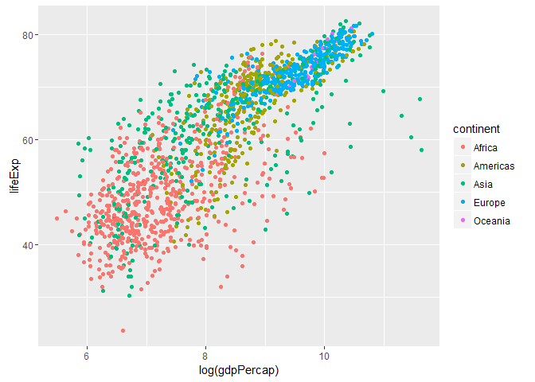
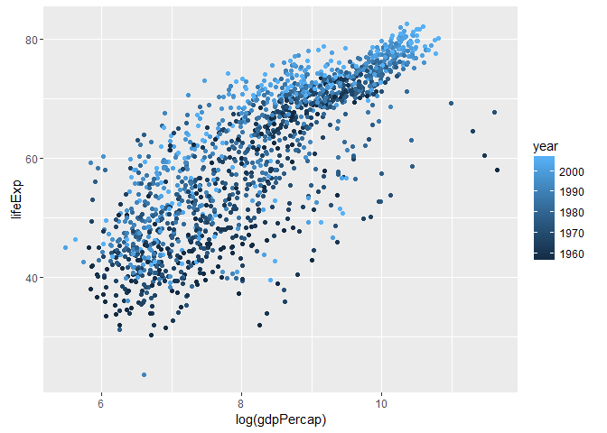

# Gapminder Group Project
David Dvorak, Elton Chan, Fanli Si, Jingyang Liu  
November 16, 2016  


# Our Hypothesis:
Countries with higher per-capita GDP have higher life expectancies.

# Our Analysis:


A couple potential plots:

```r
df <- gapminder %>%
  mutate(gdpPercap_change = 100*((gdpPercap - lag(gdpPercap)))/gdpPercap) %>%
  mutate(lifeExp_change = 100*((lifeExp - lag(lifeExp)))/lifeExp) %>%
  filter(year > 1952)

qplot(log(gdpPercap),lifeExp,data=df, color = continent)
```

<!-- -->

```r
qplot(log(gdpPercap),lifeExp,data=df, color = year)
```

<!-- -->

